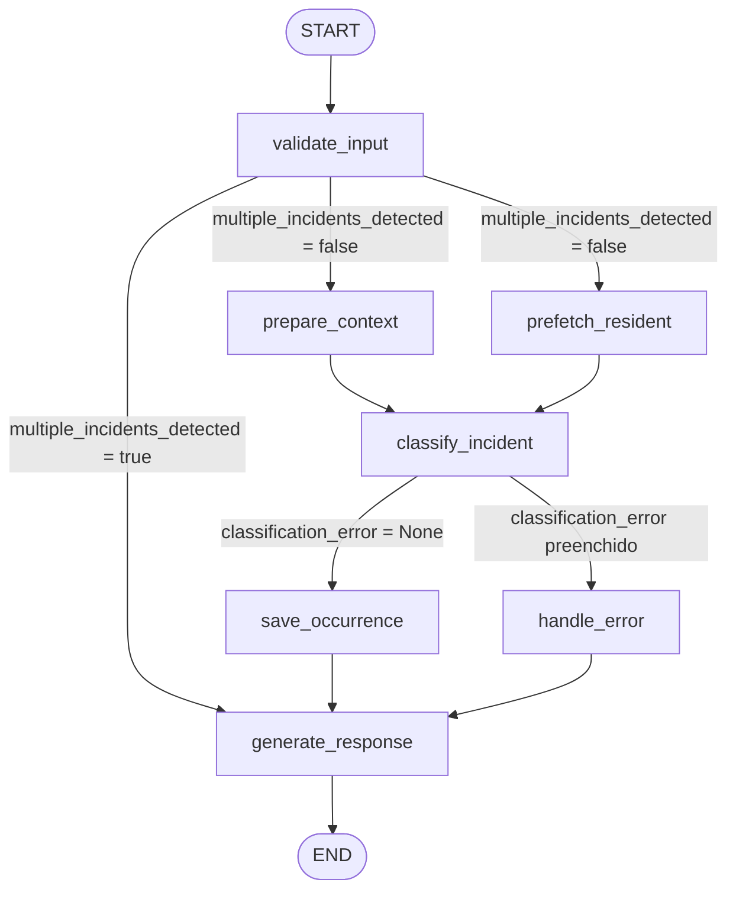

# Incident Classification Agent

## Descrição do Problema

Condomínios residenciais lidam diariamente com um volume considerável de ocorrências — visitas não autorizadas, encomendas, reclamações de barulho, falhas de manutenção e situações de segurança. Em muitos casos, esses registros são feitos manualmente por porteiros ou zeladores, sem padronização, sem categorização e sem histórico estruturado.

Essa falta de organização dificulta a identificação de reincidências, o escalonamento adequado de situações críticas e a geração de relatórios para a administração do condomínio. Além disso, a ausência de um fluxo consistente aumenta o risco de incidentes graves passarem despercebidos ou serem tratados com baixa prioridade.

## Objetivo do Agente

O **Incident Classification Agent** é um agente de IA desenvolvido com LangGraph que automatiza o registro e a classificação de incidentes em condomínios residenciais.

A partir de um relato em linguagem natural, o agente:

- **Valida** os dados de entrada e detecta relatos com múltiplos incidentes
- **Consulta** o cadastro de moradores para verificar autorizações e identificar residentes
- **Verifica** o histórico de ocorrências anteriores para detectar reincidências
- **Classifica** o incidente por categoria e severidade, elevando a severidade automaticamente em caso de reincidência
- **Persiste** a ocorrência em disco com todos os metadados estruturados
- **Escala** automaticamente incidentes críticos (severidade HIGH) para uma pasta dedicada
- **Gera** uma resposta formatada com o resultado do processamento

O resultado esperado é um registro padronizado de cada ocorrência, com rastreabilidade completa, histórico acumulado por apartamento e tratamento diferenciado para situações de alta severidade.

---

## Arquitetura e Fluxo com LangGraph

O agente é construído como um grafo de estados com LangGraph, onde cada nó realiza uma etapa específica do processamento. O estado é compartilhado entre todos os nós por meio do `AgentState`.

### Estados (`AgentState`)

| Campo | Tipo | Descrição |
|---|---|---|
| `user_input` | `str` | Relato textual do incidente |
| `reported_by` | `str` | Nome de quem reportou |
| `reported_at` | `str` | Data/hora do reporte (ISO 8601) |
| `occurrence_id` | `str \| None` | UUID único gerado para a ocorrência |
| `category` | `Category \| None` | Categoria classificada pelo LLM |
| `severity` | `Severity \| None` | Severidade classificada pelo LLM |
| `involved_people` | `list[str]` | Nomes extraídos do relato |
| `apartment` | `str \| None` | Apartamento do incidente |
| `building` | `str \| None` | Bloco/torre do incidente |
| `summary` | `str \| None` | Resumo gerado em português |
| `conversation_history` | `list[str]` | Histórico de mensagens da conversa |
| `output_file` | `str \| None` | Caminho do arquivo JSON salvo |
| `escalated_file` | `str \| None` | Caminho do arquivo de escalonamento (apenas HIGH) |
| `classification_error` | `str \| None` | Mensagem de erro em caso de falha |
| `resident_info` | `dict \| None` | Dados do morador retornados pela tool |
| `multiple_incidents_detected` | `bool \| None` | Sinaliza relato com múltiplos incidentes |
| `session_history` | `list[dict]` | Histórico acumulado de ocorrências da sessão |

### Nós do Grafo

| Nó | Responsabilidade |
|---|---|
| `validate_input` | Valida campos obrigatórios, gera `occurrence_id` e detecta múltiplos incidentes via LLM |
| `prepare_context` | Carrega o template do prompt, injeta o histórico de sessão e monta o `conversation_history` |
| `prefetch_resident` | Consulta a API de moradores em paralelo com `prepare_context`, pré-carregando `resident_info` no estado antes do loop agentic |
| `classify_incident` | Invoca o LLM com tools disponíveis em loop agentic, extrai e valida o JSON de classificação |
| `handle_error` | Registra a falha de classificação e prepara o estado para a resposta de erro |
| `save_occurrence` | Persiste o arquivo JSON da ocorrência em disco e atualiza o `session.json` |
| `generate_response` | Formata e exibe a resposta final ao usuário (sucesso, erro ou rejeição) |

### Diagrama do Fluxo



> `prepare_context` e `prefetch_resident` executam em paralelo no mesmo super-step do LangGraph. O fan-in ocorre em `classify_incident`, que só é executado após ambos concluírem.

### Fluxos de Execução

**Fluxo principal (incidente único classificado com sucesso):**
```
START → validate_input → [prepare_context ∥ prefetch_resident] → classify_incident → save_occurrence → generate_response → END
```

**Fluxo de rejeição (múltiplos incidentes detectados):**
```
START → validate_input → generate_response → END
```

**Fluxo de erro de classificação:**
```
START → validate_input → [prepare_context ∥ prefetch_resident] → classify_incident → handle_error → generate_response → END
```

### Decisões Condicionais

- **Após `validate_input`**: se `multiple_incidents_detected = True`, o fluxo é encerrado antecipadamente em `generate_response`, sem passar pela classificação.
- **Após `classify_incident`**: se `classification_error` estiver preenchido (JSON inválido, campos ausentes ou valores fora do enum), o fluxo é desviado para `handle_error`.

### Loop Agentic em `classify_incident`

O nó `classify_incident` implementa um loop agentic com limite de 5 iterações. Em cada iteração, o LLM pode emitir tool calls. Quando isso ocorre, o `ToolNode` executa as ferramentas e retorna os resultados ao LLM para que ele incorpore as informações antes de produzir a classificação final em JSON.

Quando `prefetch_resident` já tiver populado `resident_info` no estado, `classify_incident` injeta os dados como mensagens sintéticas no histórico antes do primeiro invoke — o LLM recebe o resultado da tool sem precisar chamá-la novamente, reduzindo a latência do loop.

---

## Ferramentas Utilizadas

| Ferramenta | Finalidade | Momento no fluxo |
|---|---|---|
| `lookup_resident` | Consulta o cadastro de moradores por apartamento/bloco para verificar nome, visitantes autorizados e veículos cadastrados | Chamada pelo LLM durante `classify_incident` quando o relato menciona apartamento, nome ou placa |
| `get_session_history` | Retorna ocorrências anteriores de um apartamento registradas na sessão corrente, usadas para detectar reincidências e elevar severidade | Chamada pelo LLM durante `classify_incident` quando o relato menciona um apartamento |
| `save_occurrence` | Tool exposta ao LLM para que ele sinalize os campos classificados (categoria, severidade, resumo etc.); a gravação real em disco é feita pelo nó `save_occurrence` | Parte da interface de tools do LLM em `classify_incident` |

---

## Tecnologias Utilizadas

- **Python 3.12+** — linguagem principal do projeto
- **LangGraph** — orquestração do grafo de estados e fluxo condicional do agente
- **LangChain** — abstrações para mensagens, tools e integração com o LLM
- **LangChain Ollama** (`langchain-ollama`) — integração com modelos locais via Ollama
- **Ollama** — servidor local de LLMs (modelo padrão: `qwen2.5:7b`)
- **Pydantic** — validação e parsing do schema de entrada (`IncidentInput`)
- **python-dotenv** — carregamento de variáveis de ambiente a partir do `.env`
- **uv** — gerenciamento de dependências e ambientes virtuais
- **pytest** — execução de testes

---

## Estrutura do Projeto

```
incident-classification-agent/
├── data/
│   └── residents.json              # Cadastro de moradores do condomínio
├── examples/
│   └── input.json                  # Exemplo de entrada para teste
├── reports/                        # Gerado em runtime
│   ├── session.json                # Histórico acumulado da sessão
│   └── escalated/                  # Ocorrências HIGH escalonadas
├── src/
│   └── incident_classification_agent/
│       ├── nodes/
│       │   ├── validate_input.py
│       │   ├── prepare_context.py
│       │   ├── prefetch_resident.py
│       │   ├── classify_incident.py
│       │   ├── save_occurrence.py
│       │   ├── generate_response.py
│       │   └── handle_error.py
│       ├── tools/
│       │   ├── lookup_resident.py
│       │   ├── get_session_history.py
│       │   └── save_occurrence.py
│       ├── prompts/
│       │   └── classifier.md       # Template do prompt de classificação
│       ├── enums.py                # Category e Severity
│       ├── graph.py                # Construção e compilação do grafo
│       ├── llm.py                  # Configuração do modelo Ollama
│       ├── main.py                 # Ponto de entrada da aplicação
│       ├── schemas.py              # Schema Pydantic de entrada
│       ├── session.py              # Persistência do histórico de sessão
│       └── state.py                # Definição do AgentState
├── tests/
│   └── test_llm.py
├── .env.example
├── .python-version
├── pyproject.toml
└── uv.lock
```

---

## Como Executar o Projeto

### Pré-requisitos

- **Python 3.12+**
- **uv** — gerenciador de dependências ([guia de instalação](https://docs.astral.sh/uv/getting-started/installation/))
- **Ollama** instalado e em execução localmente ([ollama.com](https://ollama.com))
- Modelo de LLM disponível no Ollama (padrão: `qwen2.5:7b`)

### 1. Clone o repositório

```bash
git clone https://github.com/<seu-usuario>/incident-classification-agent.git
cd incident-classification-agent
```

### 2. Instale as dependências

```bash
uv sync
```

### 3. Configure as variáveis de ambiente

Copie o arquivo de exemplo e defina o modelo Ollama desejado:

```bash
cp .env.example .env
```

Edite o `.env`:

```dotenv
# Exemplos: qwen2.5:7b, llama3.1:8b, mistral:7b
OLLAMA_MODEL=qwen2.5:7b
```

### 4. Baixe o modelo no Ollama

```bash
ollama pull qwen2.5:7b
```

### 5. Inicie o servidor de moradores (FastAPI)

A tool `lookup_resident` consulta os dados dos moradores via HTTP. O servidor deve estar em execução antes de iniciar o agente.

```bash
uv run uvicorn api.main:app --reload
```

O servidor sobe em `http://localhost:8000` por padrão. Para usar outra porta ou host, ajuste a variável `RESIDENTS_API_URL` no `.env`.

### 6. Execute o agente

```bash
uv run python -m incident_classification_agent.main examples/input.json
```

Para processar um arquivo de entrada personalizado:

```bash
uv run python -m incident_classification_agent.main caminho/para/seu/input.json
```

### Executar os testes

```bash
uv run pytest
```

---

## Exemplo de Entrada

O arquivo de entrada deve ser um JSON com os seguintes campos:

```json
{
    "user_input": "Às 09h15 Ana Mendes chegou à portaria informando que iria visitar Carlos Mendes, do apartamento 101, bloco A.",
    "reported_by": "João Silva",
    "reported_at": "2026-07-14T09:15:00Z"
}
```

| Campo | Obrigatório | Descrição |
|---|---|---|
| `user_input` | ✅ | Relato textual do incidente |
| `reported_by` | ✅ | Nome de quem está reportando |
| `reported_at` | ❌ | Data/hora em ISO 8601. Default: momento atual em UTC |

---

## Exemplo de Saída

Para a entrada acima, a saída esperada no terminal é:

```
⏳ Processando...

✅ Ocorrência registrada com sucesso.

🆔 ID: a3f2c1d0-84b2-4e91-bf3a-2c6e1d5f9a00
📁 Categoria: ACCESS
⚠️  Severidade: LOW
🏠 Apartamento: 101
🏢 Bloco: A
👥 Envolvidos: Ana Mendes
🔍 Morador cadastrado: Carlos Mendes
   Visitantes autorizados: Ana Mendes, Roberto Mendes

📝 Resumo: Ana Mendes chegou à portaria às 09h15 solicitando acesso ao apartamento 101, bloco A. A visitante consta na lista de autorizados do morador Carlos Mendes. Acesso liberado sem irregularidades.

💾 Arquivo salvo em: reports/20260714T091500Z_a3f2c1d0-84b2-4e91-bf3a-2c6e1d5f9a00.json
```

> Os valores de `ID` e `💾 Arquivo salvo em` variam a cada execução. O conteúdo do resumo pode variar conforme o modelo utilizado.

---

## Principais Decisões de Projeto

**Modelo local com Ollama**
O uso do Ollama com modelos como `qwen2.5:7b` elimina a dependência de APIs externas pagas e mantém os dados dos moradores e das ocorrências dentro do ambiente local. O modelo é configurável via variável de ambiente, permitindo fácil troca sem alteração de código.

**Loop agentic com limit de segurança**
O nó `classify_incident` implementa um loop de até 5 iterações para executar tool calls encadeadas. O limite evita loops infinitos em caso de comportamento inesperado do modelo.

**Separação entre tool `save_occurrence` e nó `save_occurrence`**
A tool `save_occurrence` é exposta ao LLM apenas para capturar os campos classificados (categoria, severidade, resumo etc.). A persistência real em disco é responsabilidade exclusiva do nó `save_occurrence`, que injeta os campos de contexto imutáveis do estado (occurrence_id, reported_by, user_input etc.) antes de gravar o arquivo. Isso evita que o LLM sobrescreva dados de contexto.

**Escalonamento automático de HIGH**
Ocorrências com severidade HIGH são salvas em `reports/escalated/` além do diretório padrão, sinalizando explicitamente que precisam de triagem prioritária sem depender de filtros manuais.

**`thread_id` baseado em `reported_by`**
O identificador do thread do checkpointer é derivado do nome de quem reporta. Isso isola o histórico de estado por operador de portaria. A limitação conhecida é que porteiros diferentes reportando o mesmo apartamento ficam em threads distintos — o `session.json` é a fonte de verdade para reincidências, independente desse isolamento.

**Validação de entrada com Pydantic**
O schema `IncidentInput` valida e normaliza os dados antes de iniciar o grafo, rejeitando strings vazias e garantindo que `reported_at` seja sempre um datetime com timezone UTC.

---

## Limitações da Solução

- **Dependência do Ollama local**: o agente requer o Ollama instalado e em execução na mesma máquina. Não há suporte nativo para APIs de LLM em nuvem sem alteração no código.
- **Sem atomicidade no `session.json`**: a escrita no arquivo de sessão é uma operação leitura-modificação-escrita sem garantia de atomicidade. Em ambientes com múltiplos processos simultâneos, há risco de condição de corrida.
- **`thread_id` baseado em `reported_by`**: porteiros diferentes reportando o mesmo apartamento ficam em threads distintos no checkpointer, o que pode fragmentar o histórico de estado em memória.

---

## Possíveis Melhorias Futuras

- **API REST com FastAPI**: expor o agente como um serviço HTTP para integração com sistemas de portaria e aplicativos mobile
- **Persistência em banco de dados**: substituir o `session.json` por PostgreSQL ou SQLite para garantir atomicidade, consultas estruturadas e histórico entre reinicializações do processo
- **Suporte a múltiplos LLMs**: adicionar suporte a APIs de nuvem (OpenAI, Anthropic, Gemini) com seleção via variável de ambiente
---

## Considerações Finais

O Incident Classification Agent demonstra como LangGraph pode ser usado para orquestrar um fluxo de processamento estruturado com decisões condicionais, tool calling agentico e persistência de estado — tudo sem depender de serviços externos. O projeto combina validação robusta de entrada, classificação inteligente com contexto histórico e escalonamento automático de incidentes críticos, entregando um pipeline completo e extensível para gestão de ocorrências em condomínios residenciais.
