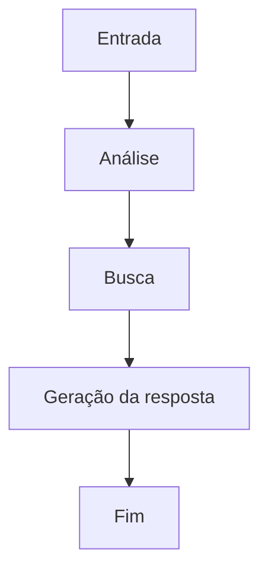

# Prompt para gerar o README de um projeto de agente com LangGraph

Você é um arquiteto de software e redator técnico especializado em projetos de IA. Sua tarefa é criar um **README.md** completo, organizado e profissional para um projeto de um agente desenvolvido com **LangGraph**.

O README deve ser escrito em **Markdown**, possuir linguagem clara e objetiva e estar estruturado com títulos e subtítulos.

Utilize as informações do projeto que serão fornecidas e produza um documento contendo obrigatoriamente as seguintes seções:

# Nome do Projeto

Apresente o nome do projeto como título principal.

# Descrição do Problema

Explique qual problema o agente resolve, qual é o contexto de utilização e quais dificuldades motivaram sua criação.

# Objetivo do Agente

Descreva o propósito do agente, quais tarefas ele executa, quais benefícios oferece e qual resultado é esperado ao utilizá-lo.

# Arquitetura e Fluxo com LangGraph

Explique detalhadamente o fluxo do agente utilizando LangGraph.

Inclua:

* descrição dos estados utilizados;
* descrição de cada nó;
* ordem de execução;
* decisões condicionais;
* ferramentas chamadas em cada etapa;
* fluxo completo desde a entrada até a resposta final.

Sempre que possível, represente o fluxo utilizando um diagrama Mermaid.

Exemplo:



# Ferramentas Utilizadas

Liste todas as ferramentas utilizadas pelo agente.

Para cada ferramenta informe:

* nome;
* finalidade;
* momento em que é utilizada no fluxo.

Exemplo:

| Ferramenta     | Finalidade                            |
| -------------- | ------------------------------------- |
| LLM            | Geração de respostas                  |
| Busca Vetorial | Recuperação de contexto               |
| Memória        | Recuperação de informações anteriores |

# Tecnologias Utilizadas

Liste as principais tecnologias empregadas no projeto, por exemplo:

* Python
* LangGraph
* LangChain
* OpenAI
* ChromaDB
* PostgreSQL
* FastAPI
* Docker

# Estrutura do Projeto

Apresente a estrutura de diretórios do projeto.

Exemplo:

```text
src/
 ├── graph/
 ├── nodes/
 ├── tools/
 ├── memory/
 ├── prompts/
 ├── models/
 └── main.py
```

# Como Executar o Projeto

Explique passo a passo como executar o projeto.

Inclua:

* pré-requisitos;
* instalação das dependências;
* configuração de variáveis de ambiente;
* criação do ambiente virtual (quando aplicável);
* comando para iniciar a aplicação.

Utilize blocos de código para todos os comandos.

# Exemplo de Entrada

Apresente pelo menos um exemplo de pergunta enviada ao agente.

# Exemplo de Saída

Apresente a resposta esperada para a entrada anterior.

# Principais Decisões de Projeto

Explique as principais decisões arquiteturais adotadas.

Exemplos:

* por que LangGraph foi escolhido;
* estratégia de memória;
* organização dos nós;
* ferramentas utilizadas;
* modelo de linguagem escolhido;
* estratégia de recuperação de contexto;
* tratamento de erros.

# Limitações da Solução

Descreva de forma transparente as limitações conhecidas.

Exemplos:

* depende de conexão com APIs externas;
* memória limitada;
* respostas sujeitas ao contexto recuperado;
* limitações do modelo de linguagem;
* cobertura parcial de alguns cenários.

# Possíveis Melhorias Futuras

Liste possíveis evoluções para o projeto.

# Considerações Finais

Faça um breve resumo do projeto destacando sua contribuição e principais características.

---

## Instruções adicionais

* Utilize Markdown válido.
* Organize o documento com títulos (`#`, `##`, `###`).
* Utilize listas, tabelas e blocos de código quando fizer sentido.
* Seja técnico, mas de fácil leitura.
* Não invente funcionalidades que não forem informadas.
* Caso alguma informação esteja ausente, indique claramente que ela deve ser preenchida posteriormente.
* O resultado deve ser um README pronto para ser utilizado diretamente no repositório GitHub.