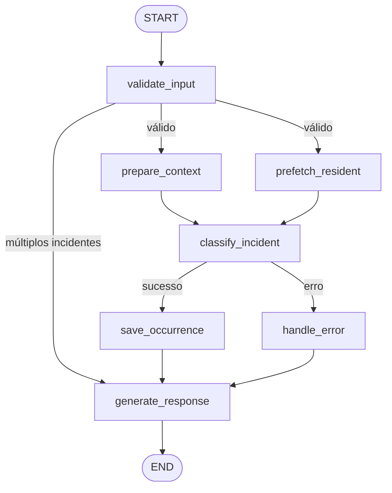

Você é um Desenvolvedor Python Sênior especialista em Python, LangGraph e LangChain.

Estou desenvolvendo um projeto acadêmico de um agente baseado em LangGraph chamado **Incident Classification Agent**.

Sua tarefa neste card é **implementar paralelização no grafo LangGraph**, introduzindo um fan-out após `validate_input` para executar `prepare_context` e um novo nó `prefetch_resident` em paralelo, com fan-in antes de `classify_incident`.

---

## Contexto do Projeto

O agente classifica incidentes em condomínios residenciais. O grafo atual segue um fluxo estritamente sequencial:

```
START → validate_input → prepare_context → classify_incident
                                         → (condicional) → save_occurrence → generate_response → END
                                         → handle_error  → generate_response → END
       → (rejeição múltiplos incidentes) → generate_response → END
```

### Grafo atual (`src/incident_classification_agent/graph.py`)

```python
graph.add_edge(START, "validate_input")

graph.add_conditional_edges(
    "validate_input",
    _route_after_validate,
    {
        "prepare_context": "prepare_context",
        "generate_response": "generate_response",
    },
)

graph.add_edge("prepare_context", "classify_incident")

graph.add_conditional_edges(
    "classify_incident",
    _route_after_classify,
    {
        "save_occurrence": "save_occurrence",
        "handle_error": "handle_error",
    },
)

graph.add_edge("handle_error", "generate_response")
graph.add_edge("save_occurrence", "generate_response")
graph.add_edge("generate_response", END)
```

### Estado do agente (`AgentState`)

Os campos relevantes para esta tarefa são:

```python
class AgentState(TypedDict):
    user_input: str
    reported_by: str
    reported_at: str
    occurrence_id: str | None
    category: Category | None
    severity: Severity | None
    apartment: str | None
    building: str | None
    summary: str | None
    conversation_history: list[str]
    output_file: str | None
    escalated_file: str | None
    classification_error: str | None
    resident_info: dict | None           # ← preenchido hoje dentro de classify_incident via tool
    multiple_incidents_detected: bool | None
    session_history: list[dict]
```

### Nó `prepare_context` (resumo)

Carrega o template de prompt do classificador, constrói o contexto histórico da sessão e adiciona a mensagem formatada a `conversation_history`. Operação puramente local (arquivo + memória), sem I/O de rede.

### Tool `lookup_resident`

Faz uma chamada HTTP para `GET /residents?apartment=...&building=...` na API FastAPI local. É a operação de I/O de rede do fluxo — candidata natural à paralelização com `prepare_context`.

---

## Tarefa 1 — Criar o nó `prefetch_resident`

Crie o arquivo `src/incident_classification_agent/nodes/prefetch_resident.py`.

Este nó deve:
- Extrair `apartment` e `building` do estado.
- Se `apartment` estiver presente, invocar a tool `lookup_resident` diretamente (sem passar pelo LLM) e armazenar o resultado em `state["resident_info"]`.
- Se `apartment` não estiver presente, retornar o estado sem modificar `resident_info`.
- Logar o resultado em nível INFO (morador encontrado / não encontrado / apartment ausente).
- Ser idempotente: se `resident_info` já estiver preenchido, não fazer nova chamada.

> **Atenção:** A tool `lookup_resident` é um `@tool` do LangChain. Para invocá-la diretamente no nó (sem o LLM), use `lookup_resident.invoke({"apartment": ..., "building": ...})`.

---

## Tarefa 2 — Implementar o fan-out e fan-in no grafo

Modifique `src/incident_classification_agent/graph.py` para que, após `validate_input` rotear para o caminho principal, tanto `prepare_context` quanto `prefetch_resident` sejam executados em paralelo antes de `classify_incident`.

O novo fluxo do caminho principal deve ser:

```
validate_input
     ↓ (rota: "prepare_context")
  ┌──┴──────────────┐
  │                 │
prepare_context  prefetch_resident    ← paralelos
  │                 │
  └──────┬──────────┘
         ↓
  classify_incident
```

Use a abordagem de nós paralelos do LangGraph: adicione ambas as arestas saindo de `validate_input` (via `add_conditional_edges` ou `add_edge` após o roteamento) e ambas chegando em `classify_incident`. O LangGraph executa nós sem dependências pendentes em paralelo automaticamente quando compilado com `checkpointer`.

Adicione um comentário no `graph.py` acima da seção de paralelização explicando a decisão:
- Por que `prepare_context` e `prefetch_resident` foram escolhidos
- O que cada um faz e por que podem rodar em paralelo (sem dependência entre si)
- Como o fan-in funciona (LangGraph aguarda ambos antes de avançar para `classify_incident`)

---

## Tarefa 3 — Adaptar `classify_incident` para usar `resident_info` pré-carregado

Atualmente o nó `classify_incident` invoca `lookup_resident` via LLM como tool call. Com o pré-carregamento paralelo, `resident_info` já pode estar preenchido antes de `classify_incident` ser executado.

Modifique o nó `classify_incident` (ou o prompt/contexto passado ao LLM) para:
- Se `state["resident_info"]` já estiver preenchido, injetar os dados no contexto enviado ao LLM em vez de forçar uma nova chamada à tool.
- O LLM ainda pode chamar `lookup_resident` normalmente se `resident_info` estiver ausente (fallback para o comportamento atual).
- Não remover a tool `lookup_resident` do bind — o fallback deve continuar funcionando.

---

## Tarefa 4 — Atualizar o diagrama Mermaid no README

Localize o diagrama Mermaid atual no `README.md` e atualize-o para refletir o novo fluxo com paralelização. O diagrama deve mostrar claramente o fan-out e o fan-in:



Adapte o estilo ao diagrama existente (classes CSS, labels, etc.).

---

## Restrições

- Não altere a interface pública dos nós existentes (`validate_input`, `prepare_context`, `classify_incident`, `handle_error`, `save_occurrence`, `generate_response`).
- O fluxo de rejeição por múltiplos incidentes (`validate_input → generate_response`) não deve ser afetado.
- O fluxo de erro (`classify_incident → handle_error → generate_response`) não deve ser afetado.
- A condição de parada do loop agentic (limite de iterações em `classify_incident`) deve continuar funcionando.
- Não adicione novas dependências ao `pyproject.toml` — a paralelização usa APIs nativas do LangGraph já presentes.

---

## Entrega

Ao final, apresente:

1. `src/incident_classification_agent/nodes/prefetch_resident.py` — novo nó criado
2. `src/incident_classification_agent/graph.py` — fan-out/fan-in implementado com comentário
3. `src/incident_classification_agent/nodes/classify_incident.py` — adaptado para usar `resident_info` pré-carregado
4. `README.md` — diagrama Mermaid atualizado

Verifique que o agente continua funcionando corretamente após a mudança executando:

```bash
# Terminal 1 — API de moradores
uv run uvicorn api.main:app --reload

# Terminal 2 — Agente
uv run python -m incident_classification_agent.main examples/input.json
```

O resultado final deve ser idêntico ao comportamento anterior — a paralelização é uma otimização interna, invisível para o usuário.
